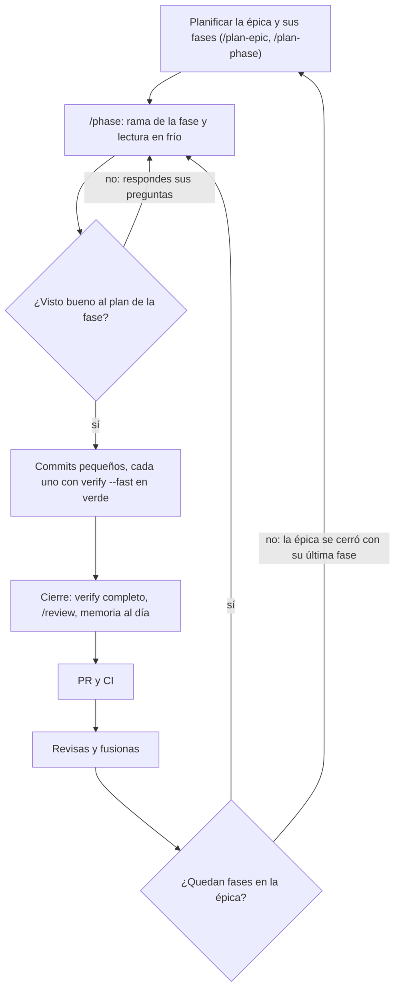

# Guía práctica

> Para quien empieza un proyecto con el kit: qué es el protocolo, cómo se instala y cómo se trabaja con él, de la
> primera épica al cierre. El detalle vive en el [README](../README.md) y en [`docs/modos.md`](modos.md); esta guía
> los enlaza y no los repite.

## 1. Qué es

Un proyecto Laravel o Next.js trabaja con agentes de IA por **épicas**, y cada épica se parte en **fases** pequeñas.

- Una fase es una sesión del agente que empieza sin memoria y termina en un PR.
- La memoria entre sesiones son unos archivos `.md` dentro del repo (`.ai/`).
- El **guardián** (`bin/check-docs.sh`) comprueba que esa memoria no miente.
- El **árbitro** (`bin/verify.sh`) decide si el código está sano, en la sesión y en la CI.
- Tú apruebas el plan de cada fase, respondes cuando el agente para a preguntar, revisas el PR y lo fusionas.
- El agente nunca fusiona ni empuja a `main`.
- Por defecto, las fases corren en tu VPS y las manejas desde la app de Claude en el teléfono.



## 2. Un proyecto nuevo

Necesitas `git`, `gh` (con `gh auth login`), gitleaks y las herramientas del stack. En el VPS,
`sh ai-protocol/docs/vps/doctor.sh` dice qué falta.

**Laravel**

```bash
laravel new mi-proyecto --pest && cd mi-proyecto && git init
composer require dedoc/scramble && composer require --dev larastan/larastan
php artisan install:api                                  # si expone una API
echo 8.4 > .php-version                                  # la versión de PHP de la CI
cd .. && sh ai-protocol/install.sh --stack laravel --target mi-proyecto && cd mi-proyecto
grep -rn '{{RELLENAR' CLAUDE.md .ai docs                 # rellena cada marcador: dice qué va
php artisan key:generate --env=testing
sh bin/contract.sh && php scripts/normalize-routes.php > docs/contract/routes-baseline.txt
bash bin/verify.sh && git add -A && git commit -m "chore(protocol): install ai-protocol"
```

**Next.js**

```bash
npx create-next-app@latest mi-front --ts --eslint --app --src-dir && cd mi-front && git init
rm AGENTS.md CLAUDE.md eslint.config.mjs                 # los del kit los sustituyen
npm i zod openapi-fetch @tanstack/react-query zustand
npm i -D openapi-typescript vitest @playwright/test eslint-plugin-boundaries eslint-import-resolver-typescript
npm pkg set engines.node=22.x                            # la versión de Node de la CI
cd .. && sh ai-protocol/install.sh --stack nextjs --target mi-front && cd mi-front
grep -rn '{{RELLENAR' CLAUDE.md .ai docs
sh bin/contract.sh
bash bin/verify.sh && git add -A && git commit -m "chore(protocol): install ai-protocol"
```

Los ajustes a mano de cada stack (la base de datos de los tests y los errores RFC 9457 en Laravel, `agentRules: false`
en Next.js…) y qué va en cada marcador están en [README §Instalación en un proyecto nuevo](../README.md#instalación-en-un-proyecto-nuevo). Después, súbelo a
GitHub y protege `main` con un *ruleset* que exija PR y el check `verify`
([`docs/modos.md` §Proteger main en GitHub](modos.md#proteger-main-en-github)). Si vas a usar el VPS, prepáralo una
vez ([`docs/modos.md` §VPS](modos.md#vps)).

## 3. El ciclo completo

1. **Planificar.** En una sesión, *«/plan-epic: la épica 01 —el objetivo—»*, o *«/plan-epic .ai/stages/E1.md»* si
   las tareas vienen de un plan externo. Escribe `.ai/epics/` con la épica, sus fases y su criterio de cierre, y
   apunta `.ai/STATE.md` a la primera fase. Revísalo, pídele que lo commitee en una rama propia con su PR y
   fusiónalo: `/phase` sólo arranca desde una rama cuyo `.ai/STATE.md` ya apunta a la fase.
2. **`/phase`.** En una sesión nueva (en el VPS, una sesión nueva en la app; antes, `composer install` o `npm ci`).
   - **Paso 0:** crea la rama de la fase, `phase/<NN-slug>/<FF>`.
   - **Paso A:** lee la memoria y el código, te da en tres viñetas qué hará y **para**. Respóndele o dale el visto
     bueno.
   - **Paso B:** un commit por fila del plan de la fase, cada uno con `bash bin/verify.sh --fast` en verde. Si
     algo no está decidido, para con un **STOP & ASK**: opciones y su recomendación. Lo que respondes queda en
     `.ai/DOMAIN.md` y no se vuelve a preguntar.
   - **Paso C:** `bash bin/verify.sh` completo, `/review` (otro agente, de sólo lectura, compara el diff con la
     fase), el RESULTADO de la fase, la memoria al día y una pregunta para ti: qué te estorbó, te faltó o te sobró
     del protocolo.
3. **PR.** La fase empuja su rama y abre el PR con la plantilla. La CI repite `bin/verify.sh` completo.
4. **Revisión y fusión.** Lees el RESULTADO y el diff, y fusionas tú.
5. **Siguiente fase.** Con el PR fusionado, `main` ya apunta a ella: otra sesión nueva y `/phase`. Una fase de
   operación que espera algo que sólo tú puedes comprobar cierra en `ESPERA_EVIDENCIA`, y el puntero la salta;
   cuando tengas la evidencia, `/phase <epica> <FF>` y pégala.
6. **Cierre de la épica.** Lo hace la fase que deja `HECHA` la última de la épica, en su mismo cierre: comprueba el
   criterio de cierre de su epic-plan y la marca `CERRADA`. Después, la siguiente épica, desde el paso 1.

Si una sesión se corta a medias, `/close` documenta lo que de verdad hizo; `/phase` la retoma después.

## 4. Para qué sirve cada pieza

| Pieza | Para qué |
|---|---|
| `CLAUDE.md` | La puerta de entrada de cualquier sesión: qué leer, qué no se hace, dónde vive cada cosa. |
| `.ai/STATE.md` | El puntero: qué fase toca, el mapa de fases y lo que bloquea. |
| `.ai/DOMAIN.md` | Lo decidido. El agente no vuelve a preguntarlo. |
| `.ai/BACKLOG.md` | Lo que se vio y no tocaba arreglar en esa fase, y lo pendiente en el otro repo. |
| `.ai/PROTOCOL.md` | Las mejoras del protocolo que proponen el agente y tú. |
| `.ai/epics/` | Las épicas y sus fases, con el RESULTADO y la evidencia de cada una. |
| `.ai/stages/` | Las tareas que llegan de un plan externo, para convertirlas en una épica. |
| `.ai/project/` | Lo propio del proyecto: contexto, versiones, alcance, contrato, glosario, zonas sensibles. |
| `.ai/RULES.md`, `.ai/rules/` | Las reglas de código del stack. |
| `.ai/WORKFLOW.md` | Cuándo para el agente, cómo pregunta y cómo verifica. |
| `.claude/skills/` | `/plan-epic`, `/plan-phase`, `/phase`, `/review` y `/close`. |
| `.claude/agents/reviewer.md` | El revisor: lee el diff sin ver la conversación. |
| `.claude/settings.json` | Qué ejecuta el agente sin preguntar y qué nunca (empujar a `main`, fusionar…). |
| `bin/check-docs.sh` | El guardián: que la memoria sea coherente. Es el primer gate de `bin/verify.sh`. |
| `bin/verify.sh` | El árbitro: todos los gates del stack, con una baseline que nunca empeora. |
| `bin/check-protocol.sh` | Que una fase no cambie los archivos del kit sin decirlo. |
| `bin/handoff.sh` | Lo que una fase dejó dicho para la siguiente, y nada más. |
| `bin/contract.sh` | El contrato OpenAPI: lo genera y comprueba que no cambió sin querer. |
| `docs/runbooks/release.md` | Lo que cada fase deja por hacer en producción al desplegar. |
| `.ai/protocol.lock` | Qué versión del kit está instalada; `install.sh --upgrade` lo usa para actualizar. |

## 5. Un ejemplo de inicio a fin

La épica de prueba del kit: `tests/lib.sh` (`make_test_epics`) la construye, y `tests/run.sh` y los e2e
(`tests/e2e-laravel.sh`, `tests/e2e-nextjs.sh`) comprueban que el guardián y `bin/verify.sh` la aceptan en un
proyecto de verdad.

1. **El paquete.** Copias en `.ai/stages/E1.md` las tareas del plan externo que tocan a este repo
   (`tests/fixtures/stages/E1.md`): E1-01, un listado de demos; E1-02, el dominio de producción; E1-03, un texto
   de bienvenida; y E1-04, que es de otro repo.
2. **La épica.** *«/plan-epic .ai/stages/E1.md»* crea `.ai/epics/02-paquete/epic-plan.md` y una fase por tarea
   de este repo, con su criterio copiado literal. E1-04 no entra.
   - `.ai/epics/02-paquete/phase-01.md`: de código.
   - `.ai/epics/02-paquete/phase-02.md`: de operación, con una casilla `[humano]`: `dig +short demo.example`.
   - `.ai/epics/02-paquete/phase-03.md`: ligera, con uno o dos entregables.
3. **Fase 01.** `/phase`: rama `phase/02-paquete/01`, sus viñetas, tu visto bueno, los commits y el PR. La
   fusionas, y queda `HECHA`.
4. **Fase 02.** El agente deja versionados los scripts y el runbook del dominio, pero no puede comprobar el DNS:
   cierra en `ESPERA_EVIDENCIA`, con su PR, que también fusionas, y `.ai/STATE.md` apunta a la 03.
5. **Fase 03.** Ligera: si no tiene preguntas, no para en el Paso A. `sh bin/handoff.sh 02-paquete 01` le dice lo
   que dejó la 01.
6. **La evidencia.** Cuando el dominio resuelve, `/phase 02-paquete 02` con la salida de `dig`. La 02 queda `HECHA`
   y, como era la última sin `HECHA`, cierra la épica: `.ai/epics/02-paquete/epic-plan.md` pasa a `CERRADA`.

## 6. Recomendaciones

- **Una sesión por fase**, siempre nueva. Lo que la fase siguiente necesita está en el RESULTADO de la anterior, no
  en el chat.
- **Fusiona antes de lanzar la siguiente fase**: así sale de `main` con el puntero ya en ella.
- **Fases que se revisan en diez minutos.** Si una no cabe, pide a `/plan-phase` que la parta.
- **Decide en el Paso A, no al final.** Una pregunta respondida antes de escribir código es más barata.
- **Responde la pregunta del cierre.** Lo que sirve a todos los proyectos va como issue a ai-protocol, con su fila de
  `.ai/PROTOCOL.md`.
- **No edites los archivos del kit en una fase.** Si hace falta, en un commit `chore(protocol): …`; mejor, con
  `install.sh --upgrade`.
- **Ante algo raro**, `sh bin/check-docs.sh --strict`: si el guardián falla, la memoria no es fiable y la fase no
  arranca.
- **En el VPS, una fase a la vez por proyecto** y staging aislado de los agentes
  ([`docs/modos.md` §Aislamiento con staging](modos.md#aislamiento-con-staging)).
